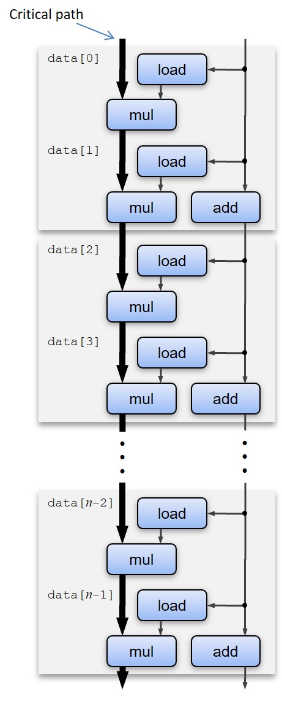
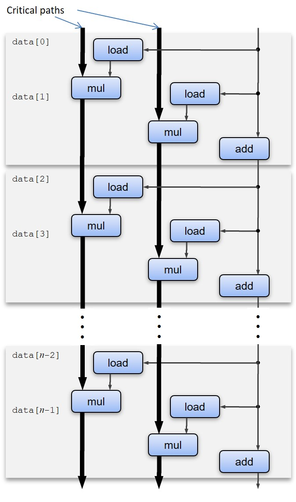
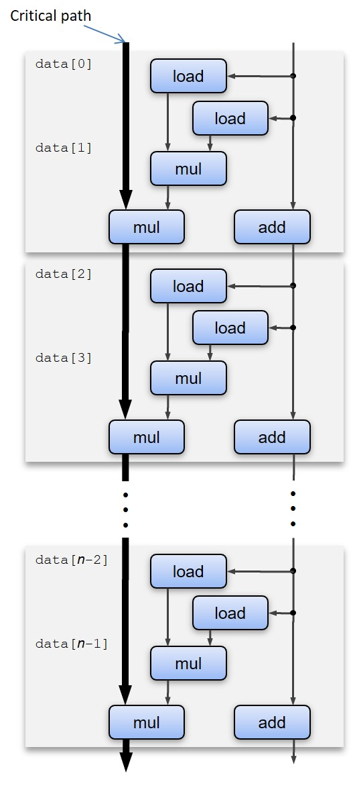

# ch5 优化程序性能  
## 1.概念
> 1. **CPE** : 产生计算结果中的一个元素的周期数  
> 2. **Intel Core i7 Haswell**(本章参考机器) 的 *8个* 功能单元:

| 编号 | 功能 |  
| --- | --- |  
|0|整数加, 整数位操作, 浮点乘, 整数除, 浮点除, 分支|
|1|整数加, 整数位操作, 浮点加, 整数乘, 浮点乘|
|2|加载, 地址计算|
|3|加载, 地址计算|
|4|存储|
|5|整数加, 整数位操作|
|6|整数加, 整数位操作, 分支|
|7|存储, 地址计算|

> 3. **Intel Core i7 Haswell** 的功能单元的性能:  

<table>
    <tr>
        <th rowspan="2">运算</th>
        <th colspan="3">整数</th>
        <th colspan="3">浮点数</th>
    </tr>
    <tr>
        <td>延迟</td>
        <td>发射</td>
        <td>容量</td>
        <td>延迟</td>
        <td>发射</td>
        <td>容量</td>
    </tr>
    <tr>
        <td>加法</td>
        <td>1</td>
        <td>1</td>
        <td>4</td>
        <td>3</td>
        <td>1</td>
        <td>1</td>
    </tr>
    </tr>
    <tr>
        <td>乘法</td>
        <td>3</td>
        <td>1</td>
        <td>1</td>
        <td>5</td>
        <td>1</td>
        <td>2</td>
    </tr>
    </tr>
    <tr>
        <td>除法</td>
        <td>3~30</td>
        <td>3~30</td>
        <td>1</td>
        <td>3~15</td>
        <td>3~15</td>
        <td>1</td>
    </tr>
</table>  

*延迟： 完成所有运算需要的总周期数*  
*发射： 两个连续的同类型运算之间最小间隔的周期数*  
*容量： 能够执行该运算的****功能单元****的数量*  

> 4. **超标量**： 每个时钟周期执行多个操作
> 5. **乱序执行**： 指令执行顺序不一定和机器级程序顺序一致  
> 6. **延迟界限**： 按照**严格顺序**执行完下述 `combine()` 所需的最小的 **CPE**  
> 7. **吞吐量界限**： 执行完下述 `combine()` 的 **CPE** 的最小界限

## 2.优化示例
实现计算一个整数或浮点数组的累加或累乘函数 `combine(vec_ptr v, data_t *dest)`  
### combine1  
```C
void combine1(vec_ptr v, data_t *dest)
{
    long i;
    *dest = IDENT;
    for (i = 0; i < vec_length(); i ++) {
        data_t val;
        get_vec_element(v, i, &val);
        *dest = *dest OP val;
    }
}
```  

### combine2  
> 改进方法：**减少过程调用**  
>- 将 `vec_length()` 函数调用从 `for` 循环拿出来  
>- 性能提升
```C
void combine2(vec_ptr v, data_t *dest)
{
    long i;
    long length = vec_length();

    *dest = IDENT;
    for (i = 0; i < length; i ++) {
        data_t val;
        get_vec_element(v, i, &val);
        *dest = *dest OP val;
    }
}
```  

### combine3
> 改进方法：**减少过程调用, 直接访问内存**
>- 由 *combine2* 的启发,我们将 `for` 循环中的 `get_vec_element()` 也拿出来  
>- 增加函数 `get_vec_start()` 获得数组首地址  
>- 其性能并没有提升  
```C
void combine3(vec_ptr v, data_t *dest)
{
    long i;
    long length = vec_length();
    data_t *data = get_vec_start(v);

    *dest = IDENT;
    for (i = 0; i < length; i ++) {
        *dest = *dest OP data[i];
    }
}
```  
### combine4
> 改进方法：**消除不必要的内存引用, 减少访存次数**
>- 将结果放在一个临时寄存器中,减少每次对内存`dest`的读写  
>   - Q. 为什么编译器不会帮忙优化？
>   - A. 如果 `dest` 作为 `v` 的 *内存别名* 传入,这种编译器优化会导致不同的程序运行结果  
```C
void combine4(vec_ptr v, data_t *dest)
{
    long i;
    long length = vec_length();
    data_t *data = get_vec_start(v);
    data_t acc = IDENT;

    for (i = 0; i < length; i ++) {
        acc = acc OP data[i];
    }

    *dest = acc;
}
```  
### combine5
>改进方法： **`k x 1` 循环展开**
>- 循环次数减少到 1/k 次,循环带来的开销减少
>- `combine()`执行依然按照严格的顺序, 因此 **CPE** 逐渐逼近**延迟界限**但**无法突破**  

>以下为 `2 x 1` 循环展开
```C
void combine5(vec_ptr v, data_t *dest)
{
    long i;
    long length = vec_length();
    long limit = length - 1;
    data_t *data = get_vec_start(v);
    data_t acc = IDENT;

    for (i = 0; i < limit; i += 2) {
        acc = (acc OP data[i]) OP data[i + 1];
    }

    for (; i < length; i ++) {
        acc = acc OP data[i];
    }

    *dest = acc;
}
```  
>以下为 `combine5` 的内循环数据流表示  

{:height="30%" width="30%"}
### combine6
>改进方法：**`k x k`** 循环展开  
>- 在 `k x 1` 的代码基础上, 内循环不再是串行计算累计结果, 而是用 `k` 个临时变量并行分别计算累计值, 最后再将 `k` 个临时变量进行累计  

> 以下是 2 x 2 循环展开
```C
void combine6(vec_ptr v, data_t *dest)
{
    long i;
    long length = vec_length();
    long limit = length - 1;
    data_t *data = get_vec_start(v);
    data_t acc0 = IDENT;
    data_t acc1 = IDENT;

    for (i = 0; i < limit; i += 2) {
        acc0 = acc0 OP data[i];
        acc1 = acc1 OP data[i + 1];
    }

    for (; i < length; i ++) {
        acc0 = acc0 OP data[i];
    }

    *dest = acc0 OP acc1;
}
```  
> 以下是 `combine6` 的内循环数据流表示  

{:height="40%" width="40%"}

### combine7
> 改进方法: **重新结合变换**
>- 在`combine5`的基础上将内循环的 `(acc OP data[i]) OP data[i + 1]` 改为 `acc OP (data[i] OP data[i + 1])`
>- 本质上是对 `k x 1` 循环展开的小修改  
>- 但是它突破了 `k x 1` 循环展开无法突破的延迟界限

> 以下是 2 x 1a 循环展开
```C
void combine7(vec_ptr v, data_t *dest)
{
    long i;
    long length = vec_length();
    long limit = length - 1;
    data_t *data = get_vec_start(v);
    data_t acc = IDENT;

    for (i = 0; i < limit; i += 2) {
        acc = acc OP (data[i] OP data[i + 1]);
    }

    for (; i < length; i ++) {
        acc = acc OP data[i];
    }

    *dest = acc;
}
```  
> 以下是 `combine7` 的内循环数据流表示  

{:height="40%" width="40%"}
### combine 性能提升表
<table>
    <tr>
        <th rowspan="2">函数</th>
        <th rowspan="2">方法</th>
        <th colspan="2">整数</th>
        <th colspan="2">浮点数</th>
    </tr>
    <tr>
        <td>加法</td>
        <td>乘法</td>
        <td>加法</td>
        <td>乘法</td>
    </tr>
    <tr>
        <th rowspan="2">combine1</th>
        <td>未优化</td>
        <td>22.68</td>
        <td>20.02</td>
        <td>19.98</td>
        <td>20.18</td>
    </tr>
    </tr>
    <tr>
        <td>-O1 编译器优化</td>
        <td>10.12</td>
        <td>10.12</td>
        <td>10.17</td>
        <td>11.14</td>
    </tr>
    </tr>
    <tr>
        <th>combine2</th>
        <td>移动vec_length()</td>
        <td>7.02</td>
        <td>9.03</td>
        <td>9.02</td>
        <td>11.03</td>
    </tr>
    <tr>
        <th>combine3</th>
        <td>直接数据访问</td>
        <td>7.17</td>
        <td>9.02</td>
        <td>9.02</td>
        <td>11.03</td>
    </tr>
    <tr>
        <th>combine4</th>
        <td>累计再临时变量(寄存器)中</td>
        <td>1.27</td>
        <td>3.01</td>
        <td>3.01</td>
        <td>5.01</td>
    </tr>
    <tr>
        <th rowspan="2">combine5</th>
        <td>2 x 1 循环展开</td>
        <td>1.01</td>
        <td>3.01</td>
        <td>3.01</td>
        <td>5.01</td>
    </tr>
    <tr>
        <td>3 x 1 循环展开</td>
        <td>1.01</td>
        <td>3.01</td>
        <td>3.01</td>
        <td>5.01</td>
    </tr>
    <tr>
        <th rowspan="3">combine6</th>
        <td>2 x 2 循环展开</td>
        <td>0.81</td>
        <td>1.51</td>
        <td>1.51</td>
        <td>2.51</td>
    </tr>
    <tr>
        <td>10 x 10 循环展开</td>
        <td>0.55</td>
        <td>1.00</td>
        <td>1.01</td>
        <td>0.52</td>
    </tr>
    <tr>
        <td>20 x 20 循环展开</td>
        <td>0.83</td>
        <td>1.03</td>
        <td>1.02</td>
        <td>0.68</td>
    </tr>
    <tr>
        <th>combine7</th>
        <td>2 x 1a 循环展开</td>
        <td>1.01</td>
        <td>1.51</td>
        <td>1.51</td>
        <td>2.51</td>
    </tr>
    <tr>
        <th colspan="2">延迟界限</th>
        <td>1.00</td>
        <td>3.00</td>
        <td>3.00</td>
        <td>5.00</td>
    </tr>
    <tr>
        <th colspan="2">吞吐量界限</th>
        <td>0.50</td>
        <td>1.00</td>
        <td>1.00</td>
        <td>0.50</td>
    </tr>
</table>  